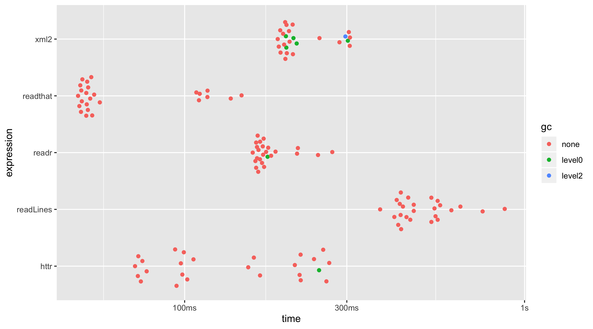

<!-- README.md is generated from README.Rmd. Please edit that file -->

# readthat

<!-- badges: start -->

[](https://CRAN.R-project.org/package=readthat)
[](https://www.tidyverse.org/lifecycle/#experimental)
[](https://travis-ci.org/mkearney/readthat)
[](https://codecov.io/gh/mkearney/readthat?branch=master)
<!-- badges: end -->

Quickly read text/source from local files and web pages.

## Installation

You can install the development released version of readthat from Github
with:

``` r
remotes::install_github("mkearney/readthat")
```

## Examples

Let’s say we want to read-in the source of the following websites:

``` r
## a vector of URLs
urls <- c(
  "https://mikewk.com",
  "https://cnn.com",
  "https://www.cnn.com/us"
)
```

Use `readthat()` to read the text/source of a single file/URL

``` r
## read single web/file (returns text vector)
x <- readthat(urls[1])

## preview output
substr(x, 1, 60)
#> [1] "<!DOCTYPE html>\n<html lang=\"en\">\n<head>\n\n  <meta charset=\"ut"

## use apply functions to read multiple pages
xx <- lapply(urls, readthat)

## preview output
lapply(xx, substr, 1, 60)
#> [[1]]
#> [1] "<!DOCTYPE html>\n<html lang=\"en\">\n<head>\n\n  <meta charset=\"ut"
#> 
#> [[2]]
#> [1] "<!DOCTYPE html><html class=\"no-js\"><head><meta content=\"IE=e"
#> 
#> [[3]]
#> [1] "<!DOCTYPE html><html class=\"no-js\"><head><meta content=\"IE=e"
```

## Comparisons

Benchmark comparison for reading a text file:

``` r
x <- "~/Dropbox/data.txt"
bm_file <- bench::mark(
  readtext = readtext::readtext(x),
  readr = readr::read_lines(x),
  readthat = readthat(x),
  readLines = readLines(x),
  check = FALSE
)
bm_file
#> # A tibble: 4 x 6
#>   expression      min   median `itr/sec` mem_alloc `gc/sec`
#>   <bch:expr> <bch:tm> <bch:tm>     <dbl> <bch:byt>    <dbl>
#> 1 readtext    753.8µs  780.6µs     1263.    4.88MB    12.5 
#> 2 readr       158.3µs  163.9µs     5928.     2.7MB     8.30
#> 3 readthat     32.6µs   33.5µs    29143.   21.69KB     2.91
#> 4 readLines    89.4µs   92.6µs    10560.    8.79KB     4.06
```


Benchmark comparison for reading a web page:

``` r
x <- "https://www.espn.com/nfl/scoreboard"
bm_html <- bench::mark(
  httr = httr::content(httr::GET(x), as = "text", encoding = "UTF-8"),
  xml2 = xml2::read_html(x),
  readthat = readthat(x),
  readLines = readLines(x, warn = FALSE),
  readr = readr::read_lines(x),
  check = FALSE,
  iterations = 25,
  filter_gc = TRUE
)
bm_html
#> # A tibble: 5 x 6
#>   expression      min   median `itr/sec` mem_alloc `gc/sec`
#>   <bch:expr> <bch:tm> <bch:tm>     <dbl> <bch:byt>    <dbl>
#> 1 httr         80.1ms  108.8ms      6.89    2.05MB    0.287
#> 2 xml2          184ms  209.7ms      4.54    1.47MB    0.864
#> 3 readthat     48.6ms   51.8ms     15.6    24.01KB    0    
#> 4 readLines   304.1ms  330.2ms      2.84  446.09KB    0    
#> 5 readr       153.7ms  174.2ms      5.45  617.49KB    0
```


