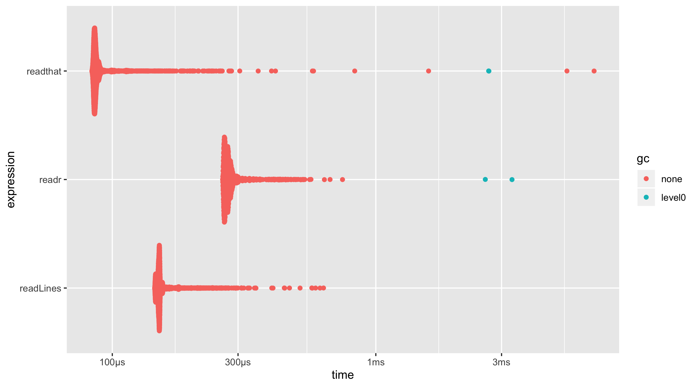

<!-- README.md is generated from README.Rmd. Please edit that file -->

# readthat

<!-- badges: start -->

[](https://CRAN.R-project.org/package=readthat)
[](https://www.tidyverse.org/lifecycle/#experimental)
[](https://travis-ci.org/mkearney/readthat)
[](https://codecov.io/gh/mkearney/readthat?branch=master)
<!-- badges: end -->

Quickly read text/source from local files and web pages.

## Installation

You can install the development released version of readthat from Github
with:

``` r
remotes::install_github("mkearney/readthat")
```

## Examples

Let’s say we want to read-in the source of the following websites:

``` r
## a vector of URLs
urls <- c(
  "https://mikewk.com",
  "https://cnn.com",
  "https://www.cnn.com/us"
)
```

Use `readthat()` to read or `downloadthat()` to download the text/source
of a single file/URL

``` r
## read single web/file (returns text vector)
x <- readthat(urls[1])

## download single web/file (returns path to downloaded file)
downloadthat(urls[1], "/tmp/mikewk.html")
#> [1] "/tmp/mikewk.html"
```

Use `readthose()` to read or `downloadthose()` to download the
texts/sources of multiple
files/URLs

``` r
## read multiple URLs/files (returns text vector–a string for each input)
x <- readthose(urls)

## download multiple URLs/files (returns paths to downloaded files)
downloadthose(urls, 
  c("/tmp/mikewk.html", "/tmp/cnn.html", "/tmp/cnnworld.html"))
#>     https://mikewk.com        https://cnn.com https://www.cnn.com/us 
#>     "/tmp/mikewk.html"        "/tmp/cnn.html"   "/tmp/cnnworld.html"
```

## Comparisons

Benchmark comparison for reading a text file:

``` r
x <- "~/Dropbox/data.txt"
bm_file <- bench::mark(
  readtext = readtext::readtext(x),
  readr = readr::read_lines(x),
  readthat = readthat(x),
  readLines = readLines(x),
  check = FALSE
)
bm_file
#> # A tibble: 4 x 6
#>   expression      min   median `itr/sec` mem_alloc `gc/sec`
#>   <bch:expr> <bch:tm> <bch:tm>     <dbl> <bch:byt>    <dbl>
#> 1 readtext    795.5µs    831µs     1196.    5.38MB    12.5 
#> 2 readr       159.8µs    165µs     5902.    2.69MB    10.4 
#> 3 readthat     28.3µs     29µs    33635.   11.06KB     0   
#> 4 readLines   132.6µs    134µs     7283.   10.54KB     2.01
```



Benchmark comparison for reading a web page:

``` r
x <- "https://www.espn.com/nfl/scoreboard"
bm_html <- bench::mark(
  httr = httr::content(httr::GET(x), as = "text", encoding = "UTF-8"),
  xml2 = xml2::read_html(x),
  readthat = readthat(x),
  readLines = readLines(x, warn = FALSE),
  readr = readr::read_lines(x),
  check = FALSE,
  iterations = 10,
  filter_gc = TRUE
)
bm_html
#> # A tibble: 5 x 6
#>   expression      min   median `itr/sec` mem_alloc `gc/sec`
#>   <bch:expr> <bch:tm> <bch:tm>     <dbl> <bch:byt>    <dbl>
#> 1 httr         79.5ms    158ms      5.52       4MB     0   
#> 2 xml2          316ms    335ms      2.72    2.65MB     1.81
#> 3 readthat      217ms    253ms      3.21    1.01MB     0   
#> 4 readLines   321.9ms    365ms      2.58    1.03MB     0   
#> 5 readr       168.1ms    173ms      5.28    1.21MB     0
```


